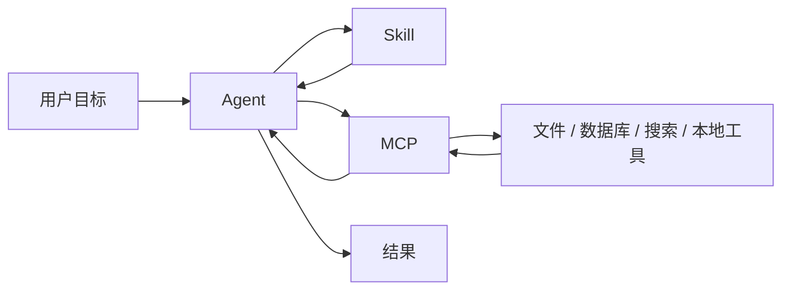

&emsp;&emsp;最近我越来越频繁地看到三个词：`MCP`、`skill`、`agent`。它们经常一起出现，容易让人误以为是同一件事。其实不是。最简单的理解是：`MCP` 解决“接什么工具”，`skill` 解决“怎么做这类任务”，`agent` 解决“谁来调度这些东西”。

### 先说结论

&emsp;&emsp;如果把 AI 系统比作一个团队，那么：

&emsp;&emsp;`agent` 是项目负责人，负责看目标、拆任务、决定什么时候调用工具。

&emsp;&emsp;`skill` 是工作方法和任务模板，告诉 agent 遇到这类问题时应该怎么做。

&emsp;&emsp;`MCP` 是统一接口，负责把外部数据源、工具和应用接进来。

&emsp;&emsp;三者不在一个层级上，所以不能混着看。

### MCP 是什么

&emsp;&emsp;MCP 全称是 `Model Context Protocol`。按照官方定义，它是一个开放标准，用来把 AI 应用连接到外部系统，比如本地文件、数据库、搜索引擎、计算器和工作流。你可以把它理解成 AI 世界里的 `USB-C` 接口：插上以后，模型就能标准化地访问外部能力。

&emsp;&emsp;MCP 重点解决的是集成问题。以前每个模型、每个工具、每个应用都要单独写适配器，形成 `N x M` 的重复开发。MCP 把这件事变成统一协议，外部系统只要按 MCP server 暴露能力，AI 应用就能按 MCP client 去接。

&emsp;&emsp;所以 MCP 不是“聪明”本身，也不是“任务执行”本身，它是连接层。

### skill 是什么

&emsp;&emsp;skill 更像一种可复用的任务说明书。官方对 Agent Skills 的描述是：给 AI coding assistant 的可移植指令集，用来提供某一类任务所需的领域知识。它通常会把一类工作拆成固定步骤、约束和参考材料，像 `SKILL.md`、`references/` 这样的结构。

&emsp;&emsp;你可以把 skill 理解为“方法论封装”。比如做 MCP server 的 skill，里面会告诉 agent：先问清楚目标、部署方式、工具面大小、认证方式，再决定生成哪种 server 模板。它不是执行器，而是把经验和规范打包好，让 agent 不至于每次都从零摸索。

&emsp;&emsp;在我看来，skill 的价值在于把“好做法”固定下来。它让 agent 不只是会调用工具，还知道在什么场景下该调用什么工具、先问什么问题、怎么收敛范围。

### agent 是什么

&emsp;&emsp;agent 才是真正干活的那层。它有目标、有上下文、有记忆，也会选择工具、执行步骤、判断结果。简单说，agent 不是一个单次回答的模型，而是一个可以持续工作、反复试错、完成任务的运行体。

&emsp;&emsp;比如你让它“帮我改这个项目的登录流程”，agent 会先读项目，再决定是否需要查文档、看代码、改文件、跑测试、回退失败修改。它不是只输出一段文本，而是会组织一连串动作。

&emsp;&emsp;所以 agent 关注的是任务闭环：理解目标，拆分动作，调用工具，检查结果，继续迭代。

### 三者怎么配合

&emsp;&emsp;这个关系图里，`skill` 和 `MCP` 都服务于 `agent`，但职责不同。`skill` 更像策略和模板，`MCP` 更像通路和接口，`agent` 则是把目标变成结果的人。

&emsp;&emsp;举个实际例子。你想让 AI 帮你写一个博客生成脚本。

&emsp;&emsp;`skill` 会告诉它：先确认输入格式、输出目录、模板规则、是否支持草稿和标签。

&emsp;&emsp;`MCP` 会让它接上本地文件系统、Git、终端、甚至数据库。

&emsp;&emsp;`agent` 会实际决定：先读现有文章，再生成脚本，最后跑测试，检查输出。

### 最容易混淆的地方

&emsp;&emsp;最常见的误解，是把 `skill` 当成 `agent`。实际上 skill 只是说明书，没有自己行动的能力。

&emsp;&emsp;另一个误解，是把 `MCP` 当成 `agent`。MCP 只是协议，它解决“怎么接”的问题，不解决“接了以后做什么”的问题。

&emsp;&emsp;还有一种误解，是以为有了 `MCP` 就够了。其实不够。MCP 只是把工具接进来，如果没有 skill 去约束方法，没有 agent 去调度执行，最后还是会变成一堆孤立接口。

### 为什么现在这三个词会一起出现

&emsp;&emsp;因为 AI 正在从“会聊天”变成“会办事”。当模型开始真正参与软件开发、数据查询、办公自动化和内容生成时，系统就必须同时具备三个东西：接外部工具的标准接口、可复用的任务方法、能持续执行任务的智能体。

&emsp;&emsp;这就是 `MCP + skill + agent` 的组合价值。MCP 让工具接得上，skill 让方法传得开，agent 让任务跑得起来。

&emsp;&emsp;如果只做 agent，不做 MCP，工具集成会很乱；如果只有 MCP，没有 skill，系统会越用越靠随机探索；如果只有 skill，没有 agent，方法论再好也落不到执行上。

&emsp;&emsp;所以这三者不是替代关系，而是分层关系。理解这一点，后面再看任何 AI coding 工具、桌面助手或者自动化框架，思路都会清楚很多。

参考：

- [What is the Model Context Protocol (MCP)?](https://modelcontextprotocol.io/docs/getting-started/intro)
- [Build with Agent Skills](https://modelcontextprotocol.io/docs/develop/build-with-agent-skills)
